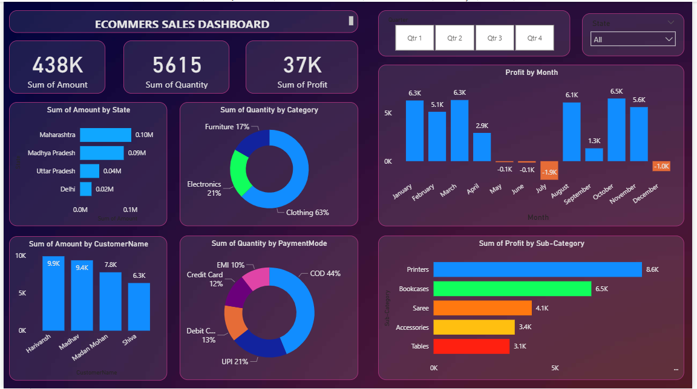

# E-Commerce Sales Dashboard (Power BI)

##  Overview
This project analyzes e-commerce sales data using Power BI.

##  Tools Used
- Power BI
- Excel / CSV

##  Dataset
- orders.csv
- customers.csv

##  Insights
- Sales trends analysis
- Customer behavior insights

## Dashboard

